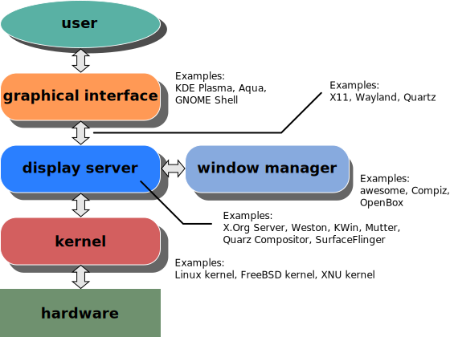

title: 深入淺出 Linux
output: index.html

--

<h1 style="font-size: 72px">
深入淺出 Linux
</h1>
 

## Denny Huang

--

### Who am I ?

 
<h2 style="font-size: 60px">
  <b>Denny Huang</b>
</h2>

* 雷亞遊戲 Rayark Inc.

* SITCON 學生計算機年會

* <a href="https://denny.one/" target="_blank">About me</a>

--

# OS?
## [Wiki](http://zh.wikipedia.org/zh-tw/作業系統)

--

<iframe width="780" height="500" src="https://www.youtube.com/embed/6NhyCXJU-IQ" frameborder="0" allowfullscreen></iframe>

  
     By Bit Blueprint / Jimmy Huang
  

--

# Free Software, Open Source, FLOSS
## [ref1](http://www.openfoundry.org/tw/legal-column-list/508-2010-07-15-10-50-34) / [ref2](https://www.gnu.org/philosophy/free-software-for-freedom.html)

--

# Richard Stallman

--

# GNU

--

# Linus Torvalds
## Linux

--

# GNU/Linux

--

### History

* [鳥哥的 Linux 私房菜](http://linux.vbird.org/linux_basic/0110whatislinux.php)
* [Unix传奇(上篇)](http://coolshell.cn/articles/2322.html)
* [Unix传奇(下篇)](http://coolshell.cn/articles/2324.html)

--

# [Linux Distro](./img/Linux_Distribution_Timeline.svg)
## [GNU/Linux Distribution Timeline](https://github.com/FabioLolix/LinuxTimeline)
## [DistroWatch](http://distrowatch.com/)
--

# 開機流程

--

<video width="780" controls>
  <source src="./video/boot_x86.webm" type="video/webm" />
</video>
<a style="font-size: 20px" href="http://people.cs.nctu.edu.tw/~huangmc/works/web/Boot_x86/Boot_x86.html#FLASH">src</a>

--

# [BIOS](http://zh.wikipedia.org/zh-tw/BIOS) / [UEFI](http://zh.wikipedia.org/zh-tw/UEFI)

--

# [MBR](http://zh.wikipedia.org/zh-tw/主開機紀錄) / [GPT](http://zh.wikipedia.org/zh-tw/GUID磁碟分割表)

--

# [Boot Loader](http://zh.wikipedia.org/zh-tw/啟動程式)

--

# File System

--

# Mount Point

--

 
<h2 style="font-size: 90px; font-weight: bold;">
<a href="http://zh.wikipedia.org/zh-tw/桌面環境">Desktop Environment</a>
</h2>

--

 
<h2 style="font-size: 90px; font-weight: bold;">
<a href="https://en.wikipedia.org/wiki/Display_server">Display server</a>
</h2>

--

## 

--

# Community

--

<h1 style="font-size:72px">Thanks for listening</h1>
